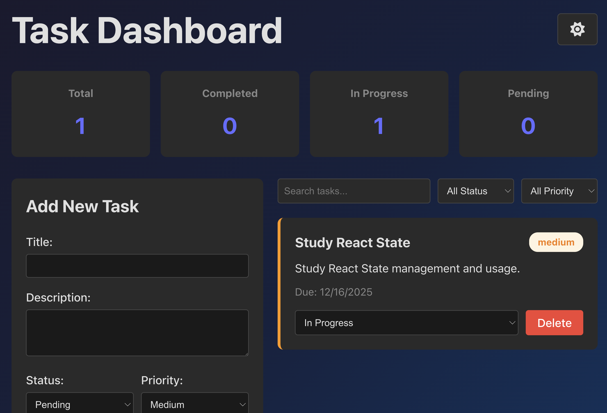

# Task Dashboard

A simple task management dashboard built with React and TypeScript for tracking and organizing tasks.
## Screenshot



## Features

- Create, read, update, and delete tasks
- Filter tasks by status (pending, in-progress, completed)
- Filter tasks by priority (low, medium, high)
- Search tasks by title or description
- Task statistics dashboard
- Dark mode toggle with gradient background
- Data persistence using localStorage
- Form validation

## Technologies Used

- React 19
- TypeScript
- Vite
- Font Awesome icons
- CSS Grid and Flexbox

## Getting Started

### Installation

```bash
npm install
```

### Run Development Server

```bash
npm run dev
```

### Build for Production

```bash
npm run build
```

## Project Structure

```
src/
├── components/
│   ├── Dashboard/
│   │   └── Dashboard.tsx      # Main dashboard component with state
│   ├── TaskForm/
│   │   └── TaskForm.tsx        # Form for adding new tasks
│   ├── TaskList/
│   │   ├── TaskList.tsx        # List container with filtering
│   │   └── TaskItem.tsx        # Individual task display
│   └── TaskFilter/
│       └── TaskFilter.tsx      # Search and filter controls
├── types/
│   └── index.ts                # TypeScript interfaces
├── utils/
│   └── taskUtils.ts            # Utility functions
├── App.tsx
├── App.css
└── main.tsx
```

## Usage

1. Add a new task using the form on the left
2. View all tasks in the main area
3. Use filters to find specific tasks
4. Click on status dropdown to update task status
5. Toggle dark mode with the moon/sun icon

## Reflection

### How I Implemented React and TypeScript Features

For this project, I focused on using React hooks for state management. I implemented separate useState hooks for each form field in the TaskForm component, which helped me understand controlled components better. The Dashboard component uses useState for managing the tasks array and filter states, and I learned to use a function inside useState to initialize data from localStorage, which prevents unnecessary reads on every render.

I used TypeScript interfaces to define the Task type with union types for status and priority fields. This was really helpful because it prevented me from accidentally using invalid values. I also learned about type-only imports to fix some compilation errors I was getting initially.

For the dark mode feature, I implemented it using a simple boolean state and conditional className, then used CSS variables to switch between light and dark themes. I added Font Awesome icons instead of emojis to make it look more professional.

### Challenges I Encountered and How I Overcame Them

One of the biggest challenges was getting the TypeScript imports to work correctly after organizing components into folders. I kept getting "Cannot find module" errors until I learned about using relative paths like '../../types' instead of './types'.

The filtering logic in TaskList took me a while to figure out. At first, I was only checking one filter at a time, but I learned that I needed to use AND logic (&&) to make sure tasks match all the active filters - search term, status, and priority.

Getting dark mode to work properly was tricky. Initially, the background wasn't changing because I was applying the .dark class to a div inside the body, not to the body itself. I had to restructure the CSS to apply the gradient background directly to the wrapper div. I also had issues with text visibility in dark mode and had to add color properties to many elements to make sure everything was readable.

The date input calendar icon was barely visible in light mode, which I fixed by learning about the color-scheme CSS property. This was a new concept for me but it makes the browser use the right theme for form controls.

### My Approach to Component Composition and State Management

I kept the state at the highest level that needed it - the Dashboard component holds all the tasks and filter states. Then I passed down the data and handler functions as props to child components. This made it easier to understand the data flow.

I broke down the UI into small, focused components:
- TaskForm handles just the form and validation
- TaskItem displays a single task
- TaskList handles filtering and mapping over tasks
- TaskFilter contains the search and filter controls
- Dashboard orchestrates everything

For form validation, I used a simple array of error messages that gets displayed if validation fails. It's not the most advanced approach but it works well and was easy to understand.

I used localStorage for persistence by storing the tasks array as JSON. I learned to use useEffect with the tasks array as a dependency so it automatically saves whenever tasks change.

Overall, I tried to keep things simple and focused on understanding the core concepts rather than adding too many features. The code is organized in a way that makes sense to me, and I added comments to help remember what I learned.
